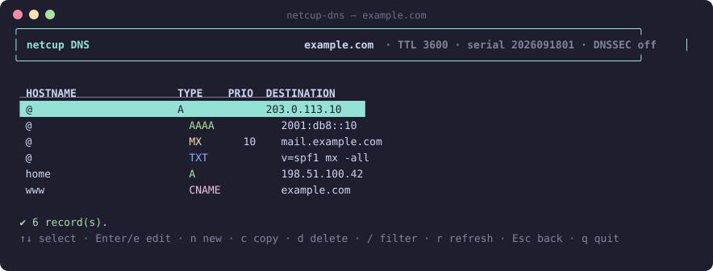
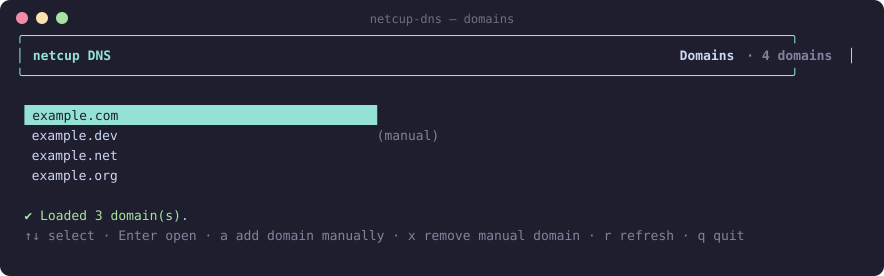
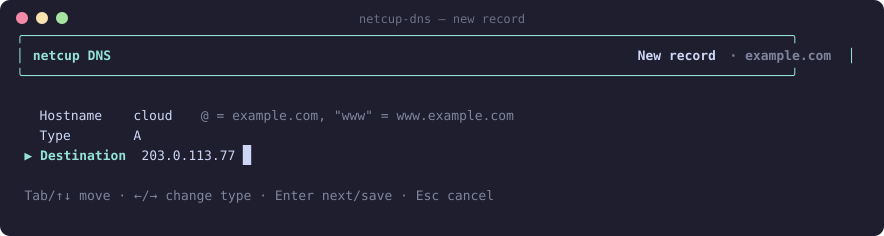
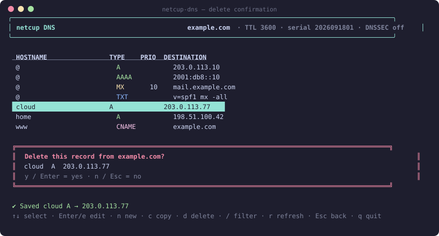

# netcup-dns

A small terminal UI to manage the DNS records of all your [netcup](https://www.netcup.de) domains, using only the netcup **DNS API** (no Customer Control Panel login needed).

- Browse every domain the API key can see, or add domains by name
- List, create, edit, copy and delete records (A, AAAA, CNAME, MX, TXT, NS, SRV, CAA, TLSA, SSHFP, OPENPGPKEY, SMIMEA)
- Filter the record table, confirm before deleting
- Single-file executables for macOS, Windows and Linux (no runtime to install), or run the bundle with Node



## Install

Grab the file for your platform from the [latest release](../../releases/latest):

| File | Needs |
| --- | --- |
| `netcup-dns-macos-arm64` | nothing (Apple Silicon) |
| `netcup-dns-macos-x64` | nothing (Intel Mac) |
| `netcup-dns-windows-x64.exe` | nothing |
| `netcup-dns-linux-x64` | nothing |
| `netcup-dns.mjs` | Node.js 20 or newer: `node netcup-dns.mjs` |

On macOS make the file executable and clear the quarantine flag once:

```sh
chmod +x netcup-dns-macos-arm64
xattr -d com.apple.quarantine netcup-dns-macos-arm64
./netcup-dns-macos-arm64
```

## Credentials

You need the three values from the netcup Customer Control Panel under *Master data → API*: customer number, API key and API password.

On first start the app asks for them and offers to store them in a config file that is readable only by your user:

| Platform | Config file |
| --- | --- |
| macOS / Linux | `~/.config/netcup-dns/config.json` |
| Windows | `%APPDATA%\netcup-dns\config.json` |

Environment variables take precedence over the file and are handy for scripts or if you prefer not to store anything:

```sh
export NETCUP_CUSTOMER_NUMBER=123456
export NETCUP_API_KEY=...
export NETCUP_API_PASSWORD=...
```

`NETCUP_DNS_CONFIG_DIR` overrides the config directory.

## Using the app



The domain list comes from the API. If your API key is not allowed to list domains, press `a` and type a domain name; manually added domains are remembered in the config file and marked *(manual)*.

| Screen | Keys |
| --- | --- |
| Domains | `↑`/`↓` select · `Enter` open · `a` add domain manually · `x` remove manual domain · `r` refresh · `q` quit |
| Records | `↑`/`↓` select · `Enter`/`e` edit · `n` new · `c` copy · `d` delete · `/` filter · `r` refresh · `Esc` back · `q` quit |
| Record form | `Tab`/`↑`/`↓` move between fields · `←`/`→` change type · `Enter` next field / save · `Esc` cancel |
| Delete prompt | `y`/`Enter` confirm · `n`/`Esc` cancel |





Hostnames follow the netcup convention: `@` is the zone root, `www` becomes `www.example.com`. Priority is only used for MX and SRV records. Changes are sent to netcup immediately; the record table is reloaded from the API after each change so you always see the real state.

## Development

```sh
npm install
npm run demo         # run the TUI against an in-memory mock of the netcup API
npm run dev          # run against the real API with your credentials
npm test             # unit tests (API client, config) and UI tests (ink-testing-library)
npm run typecheck
npm run build        # bundles everything into dist/netcup-dns.mjs
npm run screenshots  # regenerates docs/screenshots/*.svg from the mock API
```

Standalone executables are produced with [Bun](https://bun.sh):

```sh
bun build --compile --target=bun-darwin-arm64 dist/netcup-dns.mjs --outfile netcup-dns
```

Built with [Ink](https://github.com/vadimdemedes/ink) (React for the terminal) and TypeScript.

### Releases

GitHub Actions runs the tests on Linux, Windows and macOS for every push and pull request, and compiles binaries as CI artifacts. Pushing a tag such as `v0.2.0` builds the binaries for all platforms, smoke-tests them, and publishes them together with `SHA256SUMS.txt` on a GitHub release.

```sh
npm version minor
git push --follow-tags
```

## netcup API notes

The app talks to the JSON endpoint of the [netcup CCP DomainWebservice](https://ccp.netcup.net/run/webservice/servers/endpoint.php) and uses `login`, `logout`, `listallDomains`, `infoDnsZone`, `infoDnsRecords` and `updateDnsRecords`. Sessions expire after a while; the client re-authenticates transparently when that happens. An empty zone is reported by netcup as an error ("no DNS records found") and is shown as an empty table.

## License

[MIT](LICENSE)
